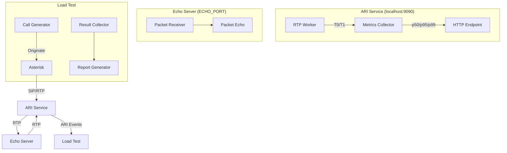

# ARI Service Architecture

## Component Diagram



## Data Flow

1. **Call Setup**:
   ```
   Load Test → ARI Originate → Asterisk → ARI StasisStart Event → ARI Service
   ```

2. **RTP Processing**:
   ```
   Asterisk → RTP Packet → ARI Service (T0) → Echo Server → ARI Service (T1) → Asterisk
   ```

3. **Latency Calculation**:
   ```
   RTT = T1 - T0 for each (SSRC, Seq) pair
   ```

4. **Metrics Collection**:
   ```
   RTT values → Percentile calculation → Periodic reporting
   ```

5. **Teardown**:
   ```
   ARI StasisEnd Event → Stop Worker → Close Socket → Release Port
   ```

## Key Implementation Details

### Packet Flow
```
┌─────────────┐    RTP     ┌─────────────┐    RTP     ┌─────────────┐
│   Asterisk  │ ────────► │ ARI Service │ ────────► │ Echo Server │
│             │           │             │           │             │
│             │           │ ├── Parse   │           │ ├── Echo    │
│             │           │ ├── T0      │           │ ├── TS      │
│             │           │ └── Forward │           │ └── Pacing  │
└─────────────┘           └─────────────┘           └─────────────┘
       ▲                         │                         │
       │                         │                         │
       │                         ▼                         │
       │                  ┌─────────────┐                  │
       │                  │   Return    │                  │
       │                  │   Path      │                  │
       │                  └─────────────┘                  │
       │                         │                         │
       │                         ▼                         │
       │                  ┌─────────────┐                  │
       │                  │  T1 Calc    │                  │
       │                  │  RTT = T1-T0│                  │
       │                  └─────────────┘                  │
       │                         │                         │
       └─────────────────────────┼─────────────────────────┘
                            Round-trip
                            Measurement
```

### Per-Channel Architecture
```
Channel Handler
├── RTP Worker (goroutine)
│   ├── UDP Socket
│   ├── Latency Tracker
│   └── Sequence Tracker
├── Bridge
├── External Media
└── Cleanup Function
```

### Metrics Flow
```
RTP Packet
    ↓
Latency Tracker (T0/T1)
    ↓
RTT Value
    ↓
Metrics Collector
    ↓
Percentile Calculation
    ↓
Periodic Reporting (5s)
    ↓
stdout + HTTP Endpoint
```